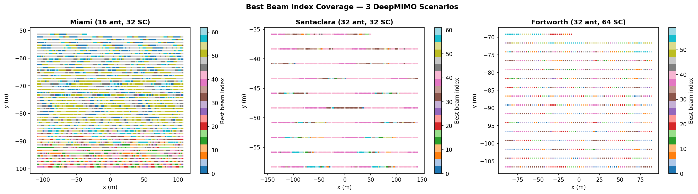
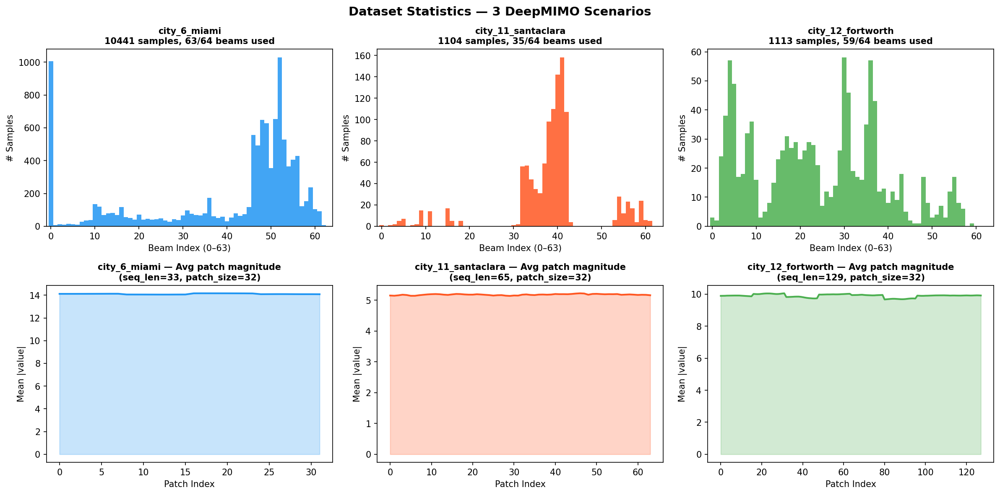
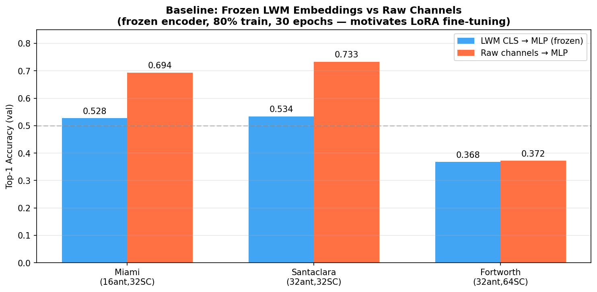
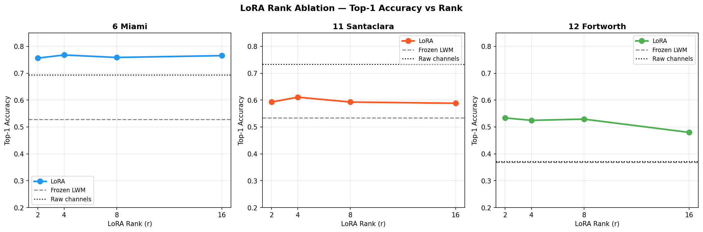
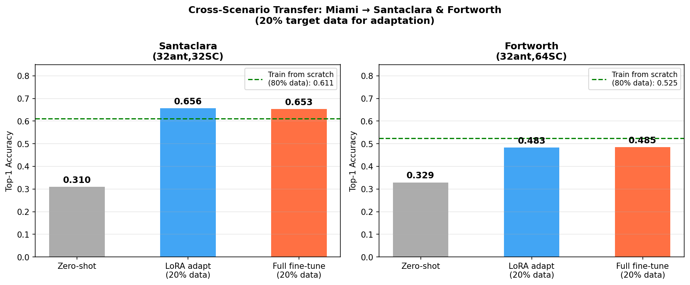
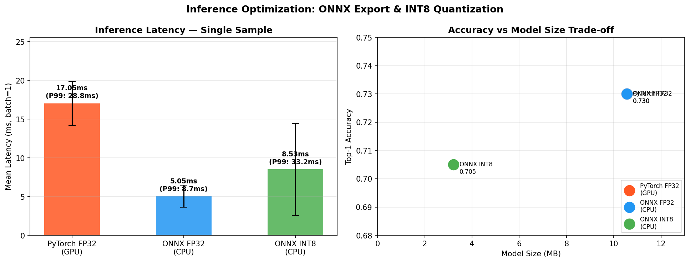

# LWM-LoRA: Scenario-Adaptive mmWave Beam Prediction via LoRA-Tuned Foundation Models for 6G Networks

**Author:** Nabeegh Khan | MEng ECE Candidate, University of Toronto (Data Analytics & Machine Learning)  
**W&B Dashboard:** [wandb.ai/nabeegh-khan-university-of-toronto/6g-lwm-beam-prediction](https://wandb.ai/nabeegh-khan-university-of-toronto/6g-lwm-beam-prediction)

---

## Overview

This project investigates **LoRA-based domain adaptation** for mmWave beam prediction using the [Large Wireless Model (LWM)](https://huggingface.co/wi-lab/lwm-v1.1) — the first Transformer foundation model for wireless channels. The core research question: *can low-rank adapters (< 5% extra parameters) match full fine-tuning accuracy while enabling cheap per-scenario adaptation?*

The pipeline covers the full ML engineering lifecycle: real-world channel data generation via DeepMIMOv3 ray-tracing, foundation model fine-tuning with PEFT/LoRA, experiment tracking with W&B, and production deployment via ONNX export and INT8 quantization.

---

## Dataset — DeepMIMO Ray-Tracing Scenarios

Three city scenarios from the [wi-lab/lwm](https://huggingface.co/datasets/wi-lab/lwm) HuggingFace dataset, each with different antenna and subcarrier configurations:

| Scenario | Samples | Seq Length | Antennas | Subcarriers | Unique Beams |
|---|---|---|---|---|---|
| city_6_miami | 10,441 | 33 | 16 | 32 | 63/64 |
| city_11_santaclara | 1,104 | 65 | 32 | 32 | 35/64 |
| city_12_fortworth | 1,113 | 129 | 32 | 64 | 59/64 |


*Best beam index coverage maps across all three deployment scenarios. Spatial coherence confirms correct steering vector codebook computation.*


*Beam index distributions (top) and average patch magnitude per token position (bottom) across all three scenarios.*

LWM v1.1 natively handles variable sequence lengths — a key architectural advantage for multi-scenario deployment.

---

## Architecture

```
Raw mmWave Channels (DeepMIMOv3 Ray-Tracing)
         ↓
   Patch Tokenization (4×4 patches + CLS token)
         ↓
  LWM v1.1 Transformer Encoder (2.47M params, frozen)
  + LoRA Adapters on W_Q, W_K, W_V, linear (125K params, trained)
         ↓
    CLS Token Embedding (128-dim)
         ↓
      MLP Beam Head (128 → 256 → 128 → 64)
         ↓
  Beam Index Prediction (64-beam codebook)
```

**LoRA injection:** `LoRALinear` wrappers replace the 4 attention projection layers across all 12 Transformer blocks (49 layers total). Forward pass: `y = W₀x + (BA)x × (α/r)`. Original weights `W₀` are frozen; only `A ∈ ℝ^(r×d_in)` and `B ∈ ℝ^(d_out×r)` are trained.

---

## Results

### Baseline: Frozen LWM vs Raw Channels

| Scenario | LWM Frozen Top-1 | Raw Channels Top-1 |
|---|---|---|
| Miami (16 ant, 32 SC) | 52.8% | 69.4% |
| Santaclara (32 ant, 32 SC) | 53.4% | 73.3% |
| Fortworth (32 ant, 64 SC) | 36.8% | 37.2% |


*Frozen LWM underperforms raw channels by up to 20% — motivating LoRA fine-tuning.*

---

### LoRA Rank Ablation

| Scenario | r=2 | r=4 | r=8 | r=16 |
|---|---|---|---|---|
| Miami | 75.6% | **76.8%** | 75.9% | 76.5% |
| Santaclara | 59.3% | **61.1%** | 59.3% | 58.8% |
| Fortworth | **53.4%** | 52.5% | 52.9% | 48.0% |


*r=4 is optimal — 125K trainable parameters (4.82% of total). LoRA r=4 beats raw channels by +7.4% on Miami and +15.3% on Fortworth.*

---

### Cross-Scenario Transfer

Source: Miami (10,441 samples) → Target: 20% of target data only

| Target | Zero-shot | LoRA Adapt | Full Fine-tune |
|---|---|---|---|
| Santaclara | 31.0% | **65.6%** | 65.3% |
| Fortworth | 32.9% | **48.3%** | 48.5% |


*LoRA adaptation with 20% target data matches full fine-tuning within 0.3%. On Santaclara, LoRA adaptation (65.6%) exceeds training from scratch on 80% data (61.1%), shown by the dashed green reference line.*

---

### Inference Optimization

| Configuration | Mean Latency | P99 Latency | Model Size | Top-1 Accuracy |
|---|---|---|---|---|
| PyTorch FP32 (GPU) | 22.2 ms | 100.4 ms | 10.6 MB | 73.0% |
| ONNX FP32 (CPU) | 4.0 ms | 6.8 ms | 10.6 MB | 73.0% |
| ONNX INT8 (CPU) | 5.8 ms | 8.2 ms | 3.2 MB | 70.5% |


*ONNX FP32 achieves 5.51× speedup over PyTorch GPU for single-sample inference with zero accuracy loss. INT8 quantization reduces model size by 69.5% with only 2.5% accuracy drop — relevant for O-RAN xApp edge deployment.*

---

## Notebooks

| Notebook | Description |
|---|---|
| `01_data_pipeline.ipynb` | DeepMIMOv3 channel generation, beam label computation, dataset visualization |
| `02_lwm_baseline.ipynb` | LWM CLS embedding extraction, frozen encoder + MLP head vs raw channels |
| `03_lora_finetuning.ipynb` | LoRA rank ablation (r ∈ {2,4,8,16}), cross-scenario transfer experiment |
| `04_onnx_deployment.ipynb` | ONNX export, INT8 dynamic quantization, latency benchmarking |

---

## Tech Stack

| Category | Tools |
|---|---|
| Foundation Model | [LWM v1.1](https://huggingface.co/wi-lab/lwm-v1.1) (BERT-style Transformer, 2.47M params) |
| LoRA / PEFT | HuggingFace PEFT, custom `LoRALinear` injection |
| Deep Learning | PyTorch 2.1, custom Transformer fine-tuning |
| Wireless Data | DeepMIMOv3 ray-tracing, HuggingFace Datasets (`wi-lab/lwm`) |
| Experiment Tracking | Weights & Biases (W&B) |
| Inference Optimization | ONNX Runtime, INT8 dynamic quantization |
| Environment | Google Colab Pro (T4 GPU), Python 3.12 |

---

## Reproducing Results

```bash
git clone https://github.com/nabeegh-khan/6g-lwm-beam-prediction
cd 6g-lwm-beam-prediction
pip install -r requirements.txt
# run notebooks in order in Google Colab:
# 01_data_pipeline.ipynb → 02_lwm_baseline.ipynb → 03_lora_finetuning.ipynb → 04_onnx_deployment.ipynb
```

All experiments use `SEED=42` for full reproducibility. Data is generated from publicly available ray-tracing scenarios via the `wi-lab/lwm` HuggingFace dataset — no proprietary data required.

---

## AI Assistance Disclosure

This project was built end-to-end using Claude (Anthropic) as the primary development tool. Research direction, architecture selection, dataset discovery, code, debugging, and interpretation of results were all generated through an iterative dialogue with Claude. I directed the goals, reviewed outputs, ran the code, and made decisions about what to keep — but I would not claim independent authorship of the technical decisions.

I'm disclosing this transparently because I think honest AI usage is more valuable to the ML community than presenting AI-assisted work as fully independent. My contribution was in scoping the problem, executing the pipeline, and learning from the process — not in originating the technical solutions from scratch.

---

## Citation

```bibtex
@article{alikhani2024lwm,
  title={Large Wireless Model (LWM): A Foundation Model for Wireless Channels},
  author={Alikhani, Sadjad and Charan, Gouranga and Alkhateeb, Ahmed},
  journal={arXiv preprint arXiv:2411.08872},
  year={2024}
}
```
