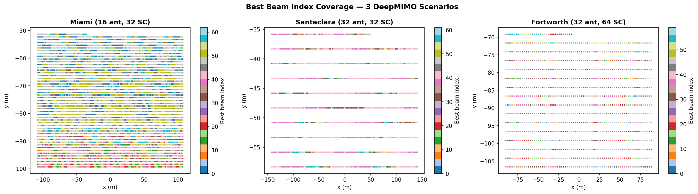
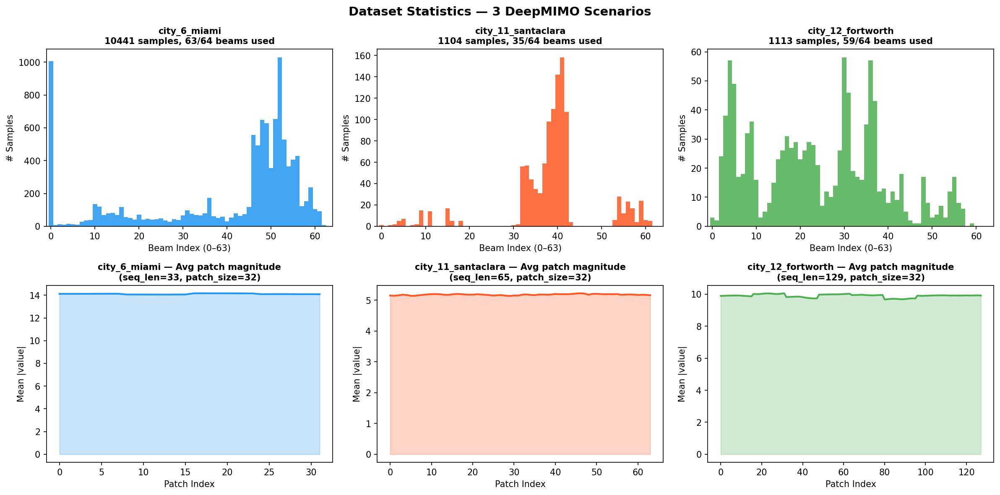
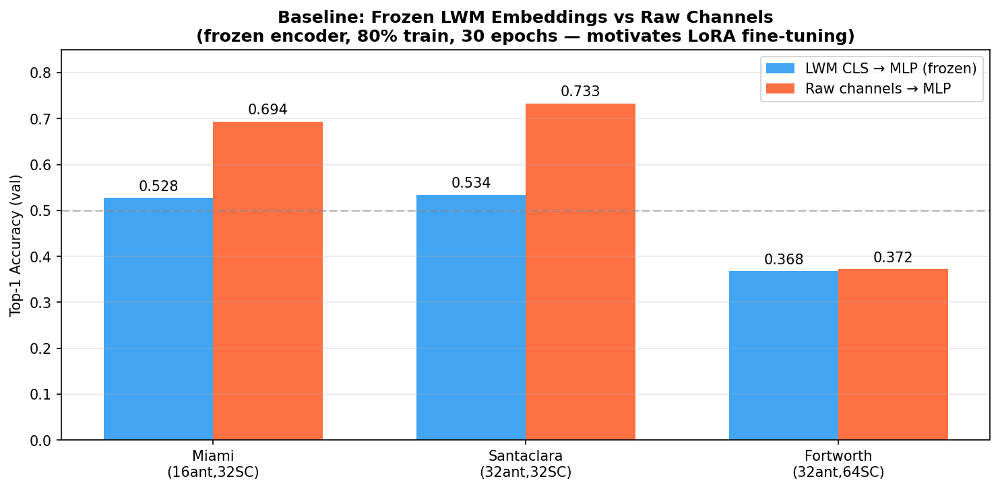
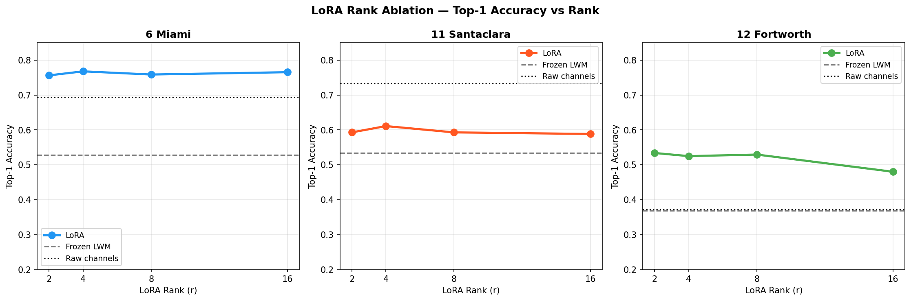
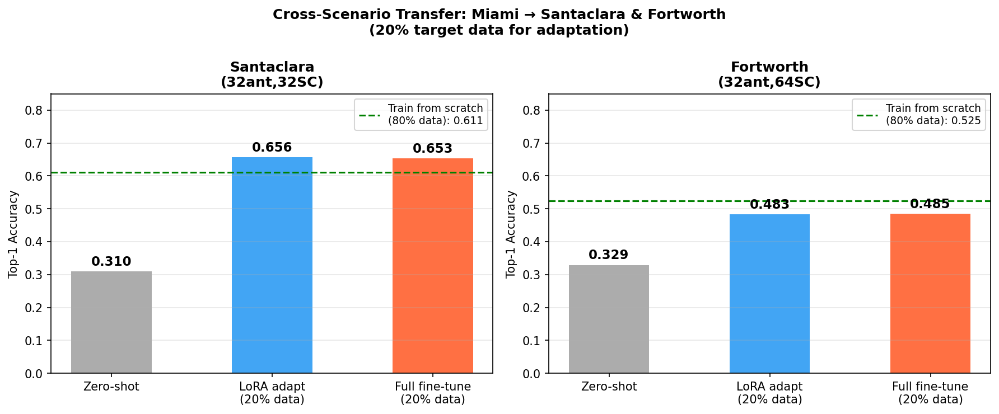
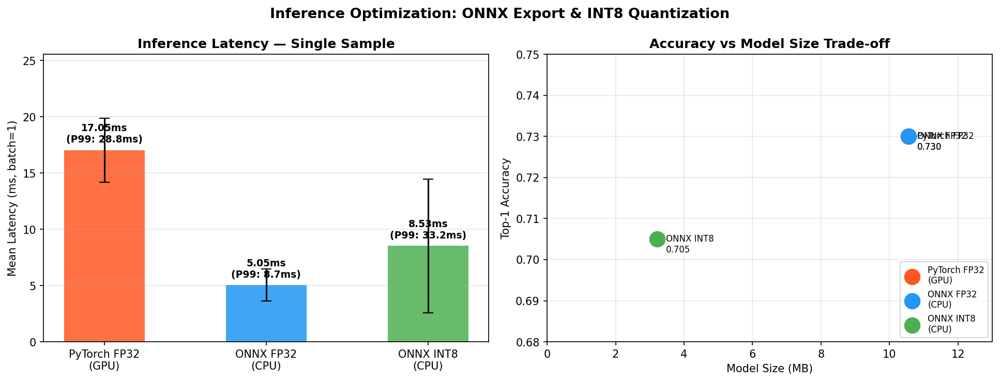

# LWM-LoRA: scenario-adaptive mmWave beam prediction

LoRA fine-tuning of a pretrained wireless foundation model (LWM) for 64-beam mmWave beam prediction, tested across three DeepMIMO city scenarios.

**TL;DR.** Rank-4 LoRA adapters train 4.82% of the model's parameters and reach 76.8% top-1 beam accuracy on the Miami scenario. On a new scenario, adapting with 20% of the target data matches full fine-tuning within 0.3 points. That last result is the one I care about most: cheap per-scenario adaptation without retraining the whole model.

## Problem

An mmWave base station has to point a narrow beam at the user, chosen from a codebook of many candidates. Pick the wrong beam and you lose a lot of signal. A model that predicts the best beam from the channel can help, but wireless deployments differ scenario to scenario (antenna counts, subcarriers, city geometry), and training a separate full model per scenario is expensive.

The question here: can a pretrained wireless foundation model be adapted to each new scenario cheaply, by training only a small number of extra parameters, and still match full fine-tuning?

LWM (the Large Wireless Model) is a Transformer encoder pretrained on wireless channels; its authors describe it as the first foundation model for wireless channels. I use it as a frozen backbone and attach LoRA adapters, which inject small trainable low-rank matrices into the attention layers while leaving the pretrained weights untouched.

## Data

Three city scenarios from the [`wi-lab/lwm`](https://huggingface.co/datasets/wi-lab/lwm) dataset on HuggingFace, generated with DeepMIMO ray tracing. 12,658 samples in total, public, no proprietary channels.

| Scenario | Samples | Seq length | Antennas | Subcarriers | Beams used |
|---|---|---|---|---|---|
| city_6_miami | 10,441 | 33 | 16 | 32 | 63/64 |
| city_11_santaclara | 1,104 | 65 | 32 | 32 | 35/64 |
| city_12_fortworth | 1,113 | 129 | 32 | 64 | 59/64 |

The scenarios differ in antenna and subcarrier configuration on purpose, so cross-scenario transfer is a real test rather than a reshuffle of the same distribution.


*Best-beam index coverage maps across the three scenarios.*


*Beam-index distributions (top) and average patch magnitude per token position (bottom), per scenario.*

## Approach

```
Raw mmWave channels (DeepMIMO ray tracing)
        ↓
Patch tokenization (4×4 patches + CLS token)
        ↓
LWM v1.1 Transformer encoder (2.47M params, frozen)
  + LoRA adapters on W_Q, W_K, W_V, output (trained)
        ↓
CLS-token embedding (128-dim)
        ↓
MLP beam head (128 → 256 → 128 → 64)
        ↓
Beam index (64-beam codebook)
```

- Frozen LWM v1.1 encoder (a BERT-style Transformer) turns a tokenized channel into a 128-dim embedding from its CLS token.
- An MLP head (128 → 256 → 128 → 64) maps that embedding to the 64-beam codebook.
- LoRA adapters wrap the query/key/value/output projections in each of the 12 Transformer blocks. Only the adapter matrices and the head train; the pretrained weights stay frozen. Update rule: `y = W0·x + (α/r)·(B·A)·x`, with `A ∈ ℝ^(r×d_in)` and `B ∈ ℝ^(d_out×r)`.

Why these choices:
- **LoRA instead of full fine-tuning**, because the whole point is cheap per-scenario adaptation. If a few low-rank matrices carry the adaptation, you keep one shared backbone and swap tiny adapters per scenario.
- **A rank sweep** (r ∈ {2,4,8,16}) to find where extra capacity stops helping.
- **A frozen-LWM baseline and a raw-channel baseline**, to check the foundation model is actually contributing rather than the head doing all the work.

## Results

All numbers are top-1 beam accuracy on a held-out test split, single run at `SEED=42` (see Limitations).

**Does the frozen foundation model help on its own?** Not before adaptation:

| Scenario | Frozen LWM | Raw channels |
|---|---|---|
| Miami | 52.8% | 69.4% |
| Santa Clara | 53.4% | 73.3% |
| Fort Worth | 36.8% | 37.2% |


*Frozen LWM trails raw channels across all three scenarios, which motivates fine-tuning.*

**LoRA rank ablation:**

| Scenario | r=2 | r=4 | r=8 | r=16 |
|---|---|---|---|---|
| Miami | 75.6 | **76.8** | 75.9 | 76.5 |
| Santa Clara | 59.3 | **61.1** | 59.3 | 58.8 |
| Fort Worth | **53.4** | 52.5 | 52.9 | 48.0 |


*Top-1 accuracy by LoRA rank; r=4 is the best trade-off.*

r=4 is the sweet spot (125K trainable parameters, 4.82% of the total). At r=4, LoRA beats the raw-channel baseline by 7.4 points on Miami and 15.3 on Fort Worth. More rank doesn't help, and slightly hurts on Fort Worth.

**Cross-scenario transfer (the main result).** Take a Miami-trained model and adapt it to a new scenario using only 20% of the target data:

| Target | Zero-shot | LoRA adapt (20% data) | Full fine-tune |
|---|---|---|---|
| Santa Clara | 31.0 | **65.6** | 65.3 |
| Fort Worth | 32.9 | **48.3** | 48.5 |


*Cross-scenario transfer: LoRA with 20% of target data matches full fine-tuning. The dashed line marks from-scratch training on 80% of the Santa Clara data.*

LoRA adaptation with 20% of the data matches full fine-tuning within 0.3 points, and on Santa Clara it beats training from scratch on 80% of the data. That is the case for adapt-instead-of-retrain.

**Inference and deployment:**

| Config | Mean latency | P99 | Size | Top-1 |
|---|---|---|---|---|
| PyTorch FP32 (GPU) | 22.2 ms | 100.4 ms | 10.6 MB | 73.0% |
| ONNX FP32 (CPU) | 4.0 ms | 6.8 ms | 10.6 MB | 73.0% |
| ONNX INT8 (CPU) | 5.8 ms | 8.2 ms | 3.2 MB | 70.5% |


*Latency, size, and accuracy across the PyTorch and ONNX configurations.*

Exporting to ONNX FP32 gives a 5.51× single-sample speedup over PyTorch-on-GPU with no accuracy loss. INT8 quantization cuts size 69.5% for a 2.5-point accuracy drop. Note that INT8 is not faster than FP32 ONNX here: it's a small model on CPU, so INT8's benefit is size, not speed.

## Reproduce

```bash
git clone https://github.com/nabeegh-khan/6g-lwm-beam-prediction
cd 6g-lwm-beam-prediction
pip install -r requirements.txt
```

Run the notebooks in order (built for Google Colab with a T4 GPU):

1. `01_data_pipeline.ipynb` — channel data, beam labels, dataset stats
2. `02_lwm_baseline.ipynb` — frozen-LWM and raw-channel baselines
3. `03_lora_finetuning.ipynb` — rank ablation and cross-scenario transfer
4. `04_onnx_deployment.ipynb` — ONNX export, INT8 quantization, latency benchmark

All runs use `SEED=42`. Data pulls from the public `wi-lab/lwm` HuggingFace dataset, so no proprietary data is needed.

## Repo structure

```
6g-lwm-beam-prediction/
├── notebooks/        01–04: data → baseline → LoRA → deployment
├── figures/          result figures used in this README
├── requirements.txt
└── README.md
```

## Limitations and next steps

- **Single seed.** These are single runs at `SEED=42`. Some rank-ablation gaps (75.6 vs 76.8) are within what could be seed noise. I haven't yet run multiple seeds to put error bars on them; multi-seed mean ± std is the next thing to add.
- **Simulated channels.** DeepMIMO is ray-traced, not measured. The sim-to-real gap is real; the DeepSense project in my portfolio is the real-measurement counterpart.
- **Small target scenarios.** Santa Clara and Fort Worth have about 1,100 samples each, so their accuracies are noisier than Miami's.
- **The low-rank claim is empirical, not proven.** LoRA working at r=4 shows the adaptation *can* be carried by a low-rank update; I did not measure the actual rank of the weight change (for example via SVD), so I don't claim to have shown the adaptation is inherently low-rank.
- **Verify the parameter count if you fork this.** The 4.82% trainable figure and the attention-layer count come straight from the training code.

## References

- Alikhani, Charan, Alkhateeb. "Large Wireless Model (LWM): A Foundation Model for Wireless Channels." arXiv:2411.08872, 2024.
- Hu et al. "LoRA: Low-Rank Adaptation of Large Language Models." arXiv:2106.09685, ICLR 2022.
- Alkhateeb. "DeepMIMO: A Generic Deep Learning Dataset for Millimeter Wave and Massive MIMO Applications." 2019.

## Authorship and tooling

I scoped the research question, chose the LWM + LoRA approach and the DeepMIMO scenarios, designed the experiments (rank ablation, cross-scenario transfer, deployment), and ran, validated, and interpreted all results. I used Claude (Anthropic) as a coding assistant to speed up the implementation and this documentation; I reviewed, tested, and modified the generated code and am responsible for its correctness. The research decisions, analysis, and conclusions are my own.
